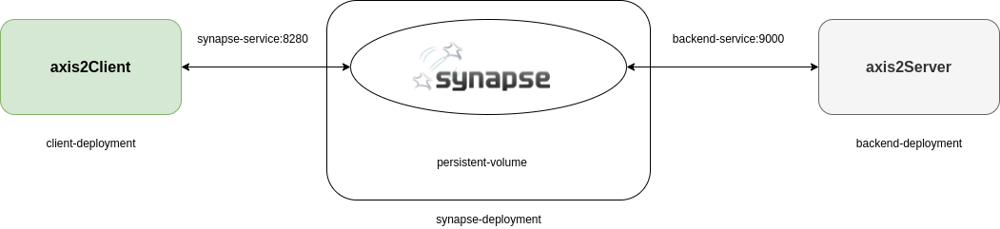

# GSoC 2021 - Containerisation of Apache Synapse ESB

## Description

This repository contains additional project files used for the final demonstration and containerization purposes.
The contents of this repo were developed in conjunction with code commits to the Apacche Synapse repo which can be found [here](https://github.com/n-jay/synapse/commits/feature1)

## Architecture

## Project structure

### Directories

**client** - Project Directory for client. axis2Client bundled with synapse used for this purpose.

**axis2Server** - Project Directory for backend. axis2Server bundled with synapse used for this purpose

**synapse** - Project Directory for Synase ESB dockerization

### Files

**backend-deployment.yml** - Used for deploying axis2Server 

**backend-service.yml** - Used for deploying service that interface with axis2Server via port 9000

**client-deployment.yml** - Used for deploying container instance to act as headful client

**synapse-deployment.yml** - Used for deploying modified Synapse ESB

**synapse-service.yml** - Used for deploying service that interface with Synapse ESB via port 8280

**synapse-config.yml** - Used for injecting environment variables to Synapse pods at deployment time

**synapse-persistent-volume.yml** - Used for allocating persistent volume space in node

**synapse-persistent-volume-claim.yml** - Used for claiming space in allocated persistent volume for synapse-deployment

### Files (Deprecated)

synapse-pod.yml

backend-pod.yml